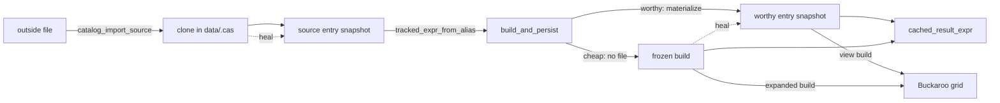

# Tallyman architecture

This document describes tallyman as the code in `src/` builds it. Where it and
the code disagree, the code is right. The rules the system promises are stated
normatively in [system-contract.md](system-contract.md), and
[caching.md](caching.md), [expression-lifecycle.md](expression-lifecycle.md),
[reactive-recalc.md](reactive-recalc.md) and [mcp-server.md](mcp-server.md) each
go deeper on one subject. The reasons for the design are in
[ADR-007](../plans/ADR-007-tallyman-owned-materialization.md) (tallyman writes
its own result files), [ADR-008](../plans/ADR-008-row-order-of-reads.md) (every
file carries a row-order column), [ADR-009](../plans/ADR-009-digest-stability.md)
(what the result digest covers) and
[ADR-011](../plans/ADR-011-sources-are-aliases.md) (a raw input is an alias).

## 1. What tallyman is

Tallyman is a notebook without cells. Its unit of work is an **entry**: one
dataframe result, stored on disk under a content hash and usually given a name.
An agent, Claude Code, writes each entry as a short Python **recipe** that
builds a xorq expression (a deferred dataframe computation, which runs only when
executed) over other entries, which it reads by name. Tallyman freezes the
expression, runs it, stores the result and records which entries it read, so
that revising one entry can recompute the entries built on it. Data files come
in through an explicit import that makes each version of a file an entry too. A
React app shows the catalog in the browser, and Buckaroo, a separate data-grid
server, draws each entry's rows.

## 2. The processes

| Process | Started by | Owns |
|---|---|---|
| MCP server, `src/tallyman_mcp/server.py` | Claude Code runs `tallyman mcp`, one per session, over stdio | the session's active project; the builds and imports the agent asks for |
| Companion, `src/tallyman_companion/app.py` | `tallyman run`, a FastAPI app on port 7860 | the API and event stream the browser uses; the builds, recalcs and resets the browser asks for; the Cache page's delete; the Buckaroo subprocess |
| Buckaroo | the companion, through `BuckarooManager` (`buckaroo_lifecycle.py`) | grid sessions and their queries: paging, sorting, search and summary statistics |

**The MCP server** has 31 tools and one prompt. It remembers the session's
active project, read from `~/.tallyman-notebooks/active_project` on the first
call and changed only by `project_switch` or `project_new`, which go through the
companion. `_with_checkpoint` commits a checkpoint (one git commit of the
catalog, section 10) after every tool that returns without an error, except
those in `_NO_CHECKPOINT`: most read-only tools, the project tools, and
`catalog_recalc` and `catalog_promote_diff`, which commit their own. After a
change the server posts to the companion's `/internal/notify`, best effort.

**The companion** serves the React app, a JSON API under `/{project}/api/`, and
a stream of Server-Sent Events (SSE, named messages on an HTTP response the
browser keeps open) at `/{project}/api/sse`. It builds through
`PUT /{project}/api/code/{alias}` (the code editor) and
`POST /{project}/api/promote_diff/{alias}/{va}/{vb}`, and its middleware
`_checkpoint_after_mutation` commits a checkpoint after every successful non-GET
request, except on routes that commit their own or change no authored state.
`tallyman serve <dir>` runs a read-only companion with no Buckaroo.

**Buckaroo** runs as `python -m buckaroo.server --port 8700 --no-browser
--stdio-control` and exits when its stdin closes. It displays, and queries only
for statistics, sorting, search and paging; tallyman finishes an entry's
computation before handing it over, so a computation never fails inside a grid
query. Buckaroo keeps each grid's state as a **session** in memory, and drops a
session that has had no browser attached for an hour.

**xorq** is a library. Tallyman uses its expression API (`xorq.vendor.ibis`, an
ibis fork), `build_expr` to freeze an expression to a directory named by its
12-character hash, `load_expr` to load one back, and its embedded DataFusion
engine, the only backend. xorq's hash covers a graph's structure and the paths
of the files it reads, not their contents. Tallyman does not use xorq's cache:
no build contains a xorq cache node, a recipe that calls `.cache()` fails to
build, and tallyman writes, names, verifies and re-creates every result file
itself (`tallyman_xorq/materialize.py`). The catalog store is tallyman's own
(`tallyman_core/catalog.py`, `catalog_state.py`).

Both the MCP server and the companion write the catalog. The **project lock**
(`catalog_state.project_lock`, a `flock` on `artifacts/catalog/.checkpoint.lock`)
makes their builds, imports, heals (re-creations of a missing result file,
section 7), checkpoints and resets happen one at a time. It is re-entrant within
a thread and blocks with no timeout. Smaller writes (an alias, a notebook cell, a
chart, a display config, `config.json`) take no lock and replace their whole
file atomically.

## 3. The project on disk

A project is `~/.tallyman-notebooks/projects/<project>/`; `TALLYMAN_HOME` moves
the root. A file is **cache** when tallyman can make it again from files that
are not cache and check what it made, so anything may delete it (ADR-007's
rule). A file is **record** when nothing can re-create it. A **log** only
explains what happened. Paths are under `artifacts/catalog/`, the catalog's git
repository, unless they start with `artifacts/` or `data/`.

| Path | Holds | Kind |
|---|---|---|
| `aliases.jsonl` | one line per alias, `{alias, latest, history, kind}` | record, tracked |
| `entries.jsonl` | the complete entry directories the last checkpoint saw | record, tracked |
| `entries/<hash>.zip` | the **recipe zip**: a deterministic archive of the entry's `expr.py`, `schema.json`, `manifest.json` and `xorq_build/`, written by the first checkpoint after the entry is made; nothing reads it back | record, tracked |
| `config.json` | project settings, one key: `auto_recalc` | record, tracked |
| `notebook.jsonl`, `chart_specs/`, `display_configs/`, `prompts/`, `post_processing/`, `stats/` | notebook cells, per-entry charts and grid settings, the prompts each entry was built from, the project's statistic and post-processing functions | record, tracked |
| `entries/<hash>/` | the entry directory (section 4) | record, untracked: every read uses it, and nothing re-creates it |
| `entries/<hash>/.xorq_build_expanded/`, `.xorq_view_build/`, `.buckaroo_stat_cache/`, `primary_key.json` | per-entry derived files | cache |
| `compute_cache/result_cache/<hash>.parquet` | snapshots, the result files of worthy entries (section 4) | cache, unless pinned because it cannot be made again faithfully (section 8) |
| `bullpen/entries/<hash>/`, `bullpen/cas/` | the **bullpen**: entry directories and clones a reset retired, kept so a reset forward can bring them back (section 10) | record, parked |
| `diff_stat_cache/<a12>-<b12>/` | Buckaroo statistics per diffed pair | cache |
| `data/.cas/<digest><suffix>` | clones: the bytes of every imported file | record |
| `artifacts/display/` | display classes, outside the repository | record, untracked |
| `artifacts/errors.jsonl`, `events.jsonl`, `telemetry.jsonl` | failures, the activity log, grid-load timings | log |

The catalog's `.gitignore` keeps the untracked paths out of `git add -A`, and
`catalog.assert_catalog_consistent`, run after every reset, rejects any tracked
path outside `TRACKED_SURFACE`. Since nothing reads a recipe zip, cloning the
catalog repository does not recreate entry directories. The logs sit outside the
repository, so a reset does not rewind them, and `errors.jsonl` holds no state:
dismissing the error banner deletes it. `tallyman init` writes a fixture at
`data/orders.parquet`, which no build reads until it is imported.

## 4. Core objects

### Entries

An **entry** is one computation, built once over inputs fixed forever, and
stored in `entries/<content_hash>/`. Its **content hash** is its name: for a
computed entry, xorq's hash of its expression after tallyman's rewrite
(section 6). Every file that expression reads is another entry's snapshot, named
by that entry's hash, so a child's hash is a function of its parents'. The chain
ends at source entries, the entries an import makes, one per version of a file,
whose hash comes from the imported bytes (section 5). The absolute project path
is part of those read paths, so the same recipe in a project at another path has
another hash. An entry directory holds:

- `expr.py`, the **recipe**, with the project path replaced by
  `${TALLYMAN_PROJECT_ROOT}`. It names inputs by alias, so running it again can
  mean something else; tallyman re-runs one only to mint a new entry in a
  recalc, and in a diagnostic after an **unfaithful heal** (a re-created result
  whose rows differ from the ones recorded, section 7).
- `xorq_build/`, the **build**: the expression as `build_expr` froze it, with
  every input fixed and paths made portable (`portable.make_portable_inplace`).
  A worthy parent appears as the path of its snapshot, a cheap parent as its
  graph inlined. Once an entry exists, its build is what it means and its recipe
  is documentation.
- `schema.json`: columns, types and the row count.
- `manifest.json`, the **manifest**: what the build does not record. It is the
  directory's last write, made atomically by `manifest.write_manifest`, and a
  directory without one is not an entry. After create, only an unfaithful heal
  rewrites it.

| Manifest field | Meaning |
|---|---|
| `content_hash`, `project`, `created_at`, `prompt` | identity and authorship |
| `parents` | `[{hash, ref, follow}]`, the parent edges |
| `cache_worthy`, `cache_worthy_why` | the worthy-or-cheap verdict and its reason |
| `row_count`, `execute_seconds`, `compile_seconds`, `cache_bytes` | measurements |
| `result_digest` | the content digest of a worthy entry's snapshot |
| `reproducible`, `nonreproducible_columns` | whether two runs at create gave the same digest |
| `unfaithful_heal_digest` | the digest an unfaithful heal wrote; it pins the snapshot |
| `snapshot_format`, `engine_versions` | the snapshot format version and the xorq, xorq-datafusion and pyarrow versions |
| `provenance` | a source entry only: where its data came from, `{alias, version, path, digest, suffix, reader, imported_at}` |

A worthy entry's **snapshot** is its result as one parquet file,
`compute_cache/result_cache/<content_hash>.parquet` (`materialize.snapshot_path`),
a path that depends on the content hash alone.

### Worthy and cheap entries

`worthiness.classify_expr` decides once, at build, on the author's expression,
whether an entry is **worthy** or **cheap**. Tallyman **materializes** a worthy
entry: it runs it to completion and writes its snapshot when the entry is
created. A cheap entry has no file; its small plan runs again on every read,
over files that exist.

An entry is cheap only if every relation in it is a file read, filter,
projection (renames, casts and computed columns), column drop, null drop or null
fill; it reads exactly one file; and no value in it multiplies rows (`Unnest`),
depends on row arrival order (a window function) or is impure (`random()`,
`uuid()`, `now()`, `today()`, any UDF). Anything else is worthy, including every
aggregate, join, sort, limit and union. The test is an allow-list because a cheap
entry pages by the `__row_order` column of the one file it reads (every
snapshot ends in one, numbering its rows `0..N-1`), so a wrong "cheap"
gives unstable paging where a wrong "worthy" costs a copy. A source entry is
worthy by definition, and a filter over a worthy entry is cheap, since it reads
a snapshot.

### Aliases and versions

An **alias** is a mutable name for a line of entries, a record
`{alias, latest, history, kind}` in `aliases.jsonl` (`tallyman_core/aliases.py`).
`latest` is the head, `history` holds versions V1 to Vn, and `<alias>-v<N>` names
version N; a name matching that pattern is refused. `set_alias` moves the head
and appends to the history.

A **catalog alias** names computed entries and moves by create, revise, recalc
and promote. A **source alias** names the versions of an imported dataset and
moves only by an import. A name is one kind or the other, and `set_alias` keeps
an alias's kind equal to its entries' kind on every route (`AliasKindMismatch`).
A source alias can be renamed or removed; the entry keeps the name it was
imported as, so a message naming a version asks the alias store which alias
holds it (`source_import.current_source_version`). An entry no alias has held,
built by `catalog_run`, is a **scratch entry**, and must be named with
`catalog_alias` before a recipe can read it.

### Parent edges

While a recipe runs, the readers in `tallyman_xorq/io.py` record each entry it
reads as a **parent edge** in `manifest.parents` (through `parent_capture.py`).
`tracked_expr_from_alias("sales")` records a **followed edge**,
`{hash: <head>, ref: "sales", follow: true}`: the child goes stale when the alias
moves. `pinned_expr_from_alias("sales-v2")` records a **pinned edge**, with
`ref: "sales-v2"` and `follow: false`: the child stays on that version. Both
return the parent's result through `cached_result_expr` (section 7). The edges
are the whole record of what an entry depends on. `follow` decides what a recalc
does and has no effect on reads, which go through the build.

### What a recipe may read

A recipe names aliases, and a build reads only the **arena**, the files tallyman
owns: the clones under `data/.cas/` and the snapshots under
`compute_cache/result_cache/`. Everything else is refused at build, and the
message says what to write instead.

| A recipe that | Is refused by |
|---|---|
| calls `read_project_file` or `tallyman_read_csv` | `io._source_entry_read` |
| calls `xo.deferred_read_csv` | `build._csv_direct_read_check` |
| calls `xo.deferred_read_parquet` on a file outside `compute_cache/` | `build._raw_parquet_read_check` |
| passes a content hash to either reader | `io` (ADR-011 D5, a bare content hash is refused in a recipe) |
| passes a bare alias to `pinned_expr_from_alias` | `io`: it would pin whatever the head happened to be |
| names an alias or version that does not exist | `io` (`ProjectDataNotFound`) |
| reads in-memory data (`ibis.memtable`, `read_in_memory`) | `source_cache.rewrite_for_build` |
| calls `.cache()` | `rewrite_for_build` |
| assigns to `__row_order` | `row_order.assert_not_assigned` |
| is cheap and drops `__row_order` | `row_order.require_on_cheap`, showing the corrected select |
| joins three entries in one chain, first and two right-hand sides carrying `__row_order` | `row_order.assert_joinable`, showing the `.drop("__row_order")` fix |
| sorts, then loses a sort key in a later order-keeping step | `row_order.canonical_sorted` |
| is a revision that follows its own alias | `catalog_revise` and `PUT /code`, after the build |

Two generated recipes break the naming rule on purpose. A source entry's recipe
calls `read_project_file`, which a context variable
(`source_import._SOURCE_ENTRY`) resolves to that entry's own snapshot; the path
in the call is provenance. A promoted diff's recipe names two content hashes
(section 11). Operations are refused too: a revise or diff promotion aimed at a
source alias is refused before anything is built, with the text of
`aliases.source_alias_refusal` (the companion answers 409), and `catalog_alias`
refuses to give a source entry a catalog name.

## 5. Data in: importing a file

This picture covers sections 5 to 7. Solid arrows happen when an entry is
created, dotted ones when a missing snapshot is healed.



A file enters the catalog only by an **import**, the MCP tool
`catalog_import_source(outside_path, alias, pinned_version=None, prompt="",
schema=None, reader_options=None)`, which calls `source_import.update_and_depend`.
It copies the bytes into the arena and points a source alias at a new **source
entry**, an ordinary entry whose rows are the file's rows. It refuses a
directory, a missing file, an alias name in version syntax, a name that is a
catalog alias, and a suffix other than `.parquet`, `.pq`, `.csv`, `.tsv` or
`.txt`. It fixes the reader options, digests the file (md5) and computes the
entry hash, then, under the project lock, picks the case (`_plan_version`),
writes the entry if it does not exist (`_mint`) and moves the alias. "Bytes"
below means the bytes read with the given reader options.

| State | Result |
|---|---|
| the alias does not exist | mint v1 |
| no `pinned_version`, bytes differ from the head | mint the next version |
| no `pinned_version`, bytes equal the head | nothing changes; the head is returned |
| bytes equal an older version | refused, naming `reset_to`, and `pinned_expr_from_alias("<alias>-v<N>")` to read that version |
| `pinned_version=N` exists and matches | nothing changes; vN is returned and the head stays |
| `pinned_version=N` exists and does not match | refused: the file, or its reader options, are not that version's |
| `pinned_version` is head + 1, bytes are new | mint it |
| `pinned_version` beyond head + 1, or below 1 | refused: versions cannot be skipped |
| bytes are a version of another alias | refused, naming that alias and version |

**The entry hash.** `source_entry_hash` is `md5("source|<digest>|<reader
signature>")` cut to 12 hex characters, the shape of xorq's hash. It cannot come
from xorq, because the entry's recipe reads the snapshot the hash names. It
covers the bytes and the reader options and nothing else, so two projects that
import one file each hold their own entry, snapshot and clone under one hash.

**Reader options.** A parquet file takes none. A CSV takes a `schema` (a dict by
column name, or ADR-005's positional list with `"&rest"`) and `polars.scan_csv`
options such as `separator`; `infer_schema_length` and `schema_overrides` are
refused. The options must survive a round trip through JSON, so a callable is
refused (`_reader_for`). They are recorded on the entry and hashed with the
bytes (`ordered_copy._reader_signature`), so a file is read one way for good,
and a CSV read two ways is two imports under two aliases. A message that advises
an import prints them (`source_import.import_call`), since a call without them
names another entry.

**The clone.** `source_identity.ensure_cas_path` copies the file to
`data/.cas/<digest><suffix>`, copy-on-write where the filesystem offers it,
digests the copy, and refuses it (`CloneDigestMismatch`) if the file changed
during the copy. The **clone** is the bytes as imported; it re-creates the
source entry's snapshot, and nothing deletes it (section 8).

**The snapshot: pyarrow and polars.** The import writes the file's rows in file
order, plus a last `__row_order` column numbered `0..N-1`, to the entry's
snapshot path. Both readers feed one pyarrow writer,
`materialize.write_pinned_parquet`, with every snapshot's settings (zstd level 3,
parquet format 2.6, statistics, a page index) in row groups of 122,880 rows
(`ordered_copy.ORDERED_COPY_ROW_GROUP_ROWS`). A parquet file needs no parser:
pyarrow reads it with `ParquetFile.iter_batches`, so the file's types survive
exactly. A CSV is parsed by polars (`io._materialize_ordered`), which keeps row
order and runs ADR-005's schema language and inference ladder (100 rows, then
10,000, then the whole file, unless every column is pinned), and whose batches
reach the writer through `collect_batches` without the frame being held whole.

**The entry.** `_mint` writes a generated `expr.py` whose header records the
path, digest and reader options, a real `xorq_build/`, `schema.json`, and last
the manifest, which marks the entry worthy and records the snapshot's
`result_digest` and the version's **provenance**, where it came from. The
presence of `provenance` is what makes an entry a source entry. Its `path` is
never read again, so moving, editing or deleting the original changes no build,
and its `alias` and `version` are the name the version was imported as.

**One set of bytes, one alias.** Bytes that are already a version of another
alias in the project are refused (`_refuse_bytes_held_elsewhere`), and the error
suggests a catalog entry whose recipe is `tracked_expr_from_alias("<that
alias>")` as a second name. The rule keys on the entry hash, so one CSV under two
sets of reader options can be two aliases.

**An existing version.** When the entry exists, the import rewrites none of its
files. If its snapshot is gone, the import restores the clone from the given
file (when the clone is gone too) and heals the snapshot through
`ensure_materialized`, verified against the recorded digest, so a repair never
changes a version's rows. A directory a crash left without a manifest is not an
entry, and is written again.

**As a catalog operation.** A minted version is recorded as an `alias_set`
event, gets a notebook cell at v1 (or the previous version's chart and display
config), is announced with `new_entry`, and runs auto-recalc for the alias's
followers (section 9), all committed by one checkpoint. An import that changes
nothing records and announces nothing, and its checkpoint is an empty commit.

## 6. The write path

`catalog_run` builds a scratch entry. `catalog_create(name, code)` refuses a
source-alias name, an existing alias or a version-shaped name, then builds and
sets the alias. `catalog_revise(name, code)` and `PUT /code` refuse a source or
unknown alias, build, refuse a recipe that follows its own alias, and move the
alias. All call `build.build_and_persist`, which holds the project lock for the
whole build, so a child's build waits for its parent's materialization:

1. **Run the recipe** (`_import_script`) with the parent collector armed. This is
   the one moment names resolve; refused reads fail here.
2. **Lint.** `_nondeterminism_warnings` warns about `now()`, `today()`,
   `random()`, `uuid()` and an unseeded `sample()`.
3. **Refuse raw reads** (`_csv_direct_read_check`, `_raw_parquet_read_check`).
4. **Classify and rewrite.** `classify_expr` gives the verdict, and
   `source_cache.rewrite_for_build` refuses what section 4 lists, gives a worthy
   entry the **canonical sort** (the author's keys, then `__row_order`, then every
   other sortable column, a total order), and moves a cheap entry's
   `__row_order` last.
5. **Freeze.** `build_expr` builds into a temporary directory named by the
   content hash. If that entry exists with a manifest, the build appends the
   prompt and returns it.
6. **Lay down** the entry directory: `xorq_build/`, made portable, and `expr.py`.
7. **Execute, with the reproducibility check.** A worthy entry is materialized by
   `materialize(project, hash, check_reproducible=True, publish=False)`: two runs
   of the frozen build, their digests compared, the first file left complete at
   a temporary name. A cheap entry is streamed once in full (`stream_row_count`)
   and nothing is kept, so a failing cast surfaces here, in tallyman.
8. **Record** `schema.json`, then the manifest (`write_manifest`).
9. **Publish.** `materialize.publish_snapshot` moves the staged file over the
   snapshot path with one `os.replace`, once the entry is complete.
10. **Prompt log.** `_append_prompt` appends to `prompts/<hash>.jsonl`.

**Materialization.** `materialize` loads the frozen build
(`result_cache.load_entry_expr`) and rebinds it onto a fresh single-partition
connection (`single_partition_backend`, batches of 8,192), so a float aggregate
merges in one order on any machine. `_stream_to_parquet` drops any inherited
`__row_order` and ibis's `__row_order_right`, numbers the rows in a new last
`__row_order`, and writes row groups of 1,048,576 rows with the settings of
section 5, to a unique temporary name under the project lock. It returns the
file's digest, read back (`digest.file_digests`). When step 7's runs differ, the
entry builds anyway: the manifest records `reproducible: false` and the columns
that differed, the snapshot is pinned, and the reply warns the author. A heal
runs once and replaces the file at once.

**After the build**, the tool sets the alias, records an event in `events.jsonl`,
appends a notebook cell for a new alias, carries chart and display config
forward on a revise (`carry_forward_entry_config`), notifies the companion with
`new_entry`, and runs auto-recalc after a revise. The checkpoint comes last, as
the tool returns, and is taken even when nothing changed.

**What a failure leaves behind.**

- Before step 6, nothing under `entries/`. Parent snapshots the recipe's reads
  re-created stay, as correct cache.
- From step 6 on, the build removes the directory it created and its temporary
  file; the file already at the snapshot path is untouched.
- A killed process can leave a directory with no manifest, which every writer
  treats as absent, and a `.<hash>.<uuid>.tmp` file in `result_cache/` that
  nothing removes. Killed between steps 8 and 9, it leaves a complete entry over
  whatever file was at the path, or none, which the next read heals.
- The MCP tools record the failure in `errors.jsonl`, add a `build_error` event,
  notify `build_failed` and skip the checkpoint; `PUT /code` answers 400.
- A revision refused for following its own alias is already built, so its entry
  stays without an alias and the next checkpoint records it.
- A failed checkpoint is logged; the next one's `git add -A` takes in the change.
- A failed import removes the directory it created; a clone or snapshot it wrote
  stays, named by content, for the next import of the same bytes.

## 7. The read path

**Loading a build.** `result_cache.load_entry_expr` fills the project path back
into a stable copy of the build, the **expanded build** in
`.xorq_build_expanded/` (`portable.ensure_expanded_build`, gated by a
`.complete` marker), and loads it with `load_expr`. A missing or unloadable build
is an error naming the entry. Nothing falls back to `expr.py`, which would read
the aliases' current heads instead of the entry's parents.

**The canonical read.** Every consumer inside tallyman's processes (`/api/data`
pages, charts, diffs, post-processing, a recipe's readers) reads a result through
`result_cache.cached_result_expr(project, hash)`. It calls `ensure_materialized`,
then returns, for a worthy entry, one bare read of its snapshot
(`deferred_read_parquet`, memoized in `_snapshot_read`), without loading the
build; this read is also how a worthy parent enters a child's build. For a cheap
entry it returns the loaded graph rebound onto the default backend
(`_resolve_result_plan`, memoized, through `rebind_onto`). Both are
single-backend expressions, so entries compose in joins, unions and diffs.

**Making files exist.** `materialize.ensure_materialized` puts every file an
entry reads, and its own snapshot, on disk before anything runs:

1. A worthy entry whose snapshot exists is done, with nothing loaded.
2. A source entry whose snapshot is missing is healed from its clone
   (`_heal_a_source`).
3. Otherwise the build is loaded, and each missing file it reads, always another
   entry's snapshot, is made by recursing on the hash in its name (`_recreate`).
4. A worthy entry whose snapshot is missing is healed (`_heal`).

A **heal** re-creates a missing snapshot and checks it against `result_digest`.
A computed entry heals by running `materialize` once. A source entry heals from
its clone, which `source_import.rewrite_source_snapshot` parses again with the
reader options in `provenance`. Both take the project lock and look again for the
file first. If a source entry's clone is gone too, the heal fails with an error
naming both files and the `catalog_import_source` call, reader options and
`pinned_version` included, that restores the version.

**Verification.** `result_cache._verify_self_heal` compares a healed file's
digest with the recorded one. A mismatch is an unfaithful heal: the rows are
served, as the honest output of the frozen build, and the heal logs a warning
that blames an engine upgrade (`_engine_change`), a recipe whose graph hashes
differently when re-run (`recipe_is_structurally_nondeterministic`) or a graph
that runs differently each time; writes the new digest into
`unfaithful_heal_digest`, which pins the file; records an `unfaithful_heal`
error for the page's banner; deletes the entry's Buckaroo statistics; and calls
`UNFAITHFUL_HEAL_HOOKS`, where the companion registers a forced grid reload
(section 11). `catalog_scan_staleness(verify_results=True)` runs the same
comparison over every snapshot on disk (`staleness.verify_sweep`) and writes
nothing.

**Row order.** Every snapshot ends in `__row_order`, an int64 column holding
`0..N-1` in physical order. `row_order.page` orders a page by any sort keys it is
given and then `__row_order`, which has no ties, so a request returns the same
rows in any process; `/api/data` gives no keys. The build rules of section 4 keep
the column meaningful, and the canonical sort decides the order a worthy entry's
rows are numbered in. ADR-008 gives the reasons.

**Digest stability.** `result_digest` is `arrow-sha256:<hex>`
(`digest.content_digest`), a SHA-256 over the file's Arrow data read back, with
separate streams per column for validity, lengths and values. It ignores the
row-group size, codec, writer version and string encoding, and changes with any
value, null, name, type or row order. Layout matters in one place: an ungrouped
float total depends on the batch boundaries of the file it reads, so the
row-group sizes (1,048,576 computed, 122,880 source) and the batch size are fixed
by `SNAPSHOT_FORMAT_VERSION`, which the manifest records (ADR-009).

**Memos.** Each process keeps `_resolve_result_plan` (256 loaded builds) and
`_snapshot_read` (1,024 snapshot reads), cleared by
`cached_result_expr.cache_clear()`. File existence is checked on every call,
outside the memos, so they change latency and never rows.

## 8. Pins and deletion

A **pinned** snapshot is one the Cache page refuses to delete because it cannot
be made again faithfully. `materialize.pinned_reason` decides from the manifest
that speaks for the file (`snapshot_manifest`: the live entry's, or the copy a
reset parked) and, for a source entry, from whether its clone exists.

| Pin reason | Read from |
|---|---|
| a source version whose clone is gone (for a retired one, from `bullpen/cas/` too) | `provenance` and the clone's path |
| a recipe whose two runs at create gave different digests | `reproducible: false` |
| a heal that produced different rows than were built | `unfaithful_heal_digest` |

The pin travels with the manifest through a reset, and dismissing the error
banner does not lift it. It protects the file from the Cache page and nothing
else.

**The Cache page is the one deleter.** Nothing in tallyman deletes a snapshot on
its own, and nothing writes one speculatively: a snapshot is written when its
entry is created or when a read needs it.
`GET /{project}/api/result_cache` lists every file in `result_cache/` with two
labels. A **retired** file has no live entry, but a reset parked one in the
bullpen, and that manifest decides its pin. An **orphan** has no entry, live or
parked, and is never pinned. `DELETE /{project}/api/result_cache/{hash}` unlinks
a file, answering 400 for a malformed hash, 403 in serve mode, 404 for no
snapshot and 409 with the reason for a pinned one. The next read heals the file;
a grid already open on it fails until the entry is opened again.

**Clones.** A clone is record, the only copy of the imported bytes, and no read,
heal or import deletes one. A source snapshot is cache while its clone exists
and pinned once it is gone. Importing the same bytes again restores the clone
only when the snapshot is gone as well. `source_identity.gc_cas` is the only code
that removes a clone from `data/.cas/`, and only `reset_to` calls it, moving each
clone that no source entry in `entries.jsonl` names
(`catalog_state._live_source_digests`) to `bullpen/cas/`. If the bullpen already
holds that file, the live copy is removed; if any surviving manifest is
unreadable, the sweep is skipped.

## 9. Staleness and recalc

**One axis.** An entry is stale when the alias of one of its followed edges
points at a different hash than the edge recorded, and for no other reason
(`staleness.entry_staleness`). A pinned edge never makes an entry stale, and a
changed data file matters only once it is imported, which moves a source alias.
The scan reads `aliases.jsonl` and the manifests and opens no data file. An edge
whose alias is missing is reported under `unknown_axes`.

**The scan.** `staleness.scan` judges every entry. Only an alias head can be
**directly stale** (`live: true`); a superseded version reports `live: false`,
since rebuilding it would move no alias. A live entry that is not directly stale
but sits downstream of one that is, is **transitively stale**.
`catalog_scan_staleness` and `GET /{project}/api/staleness` expose the scan and,
with auto-recalc on, add `orphan_stale`: each directly stale entry, classified by
`recalc.classify_orphans` as self-following, explained by a recorded error, or
unexplained.

**Recalc.** `recalc.recalc(project, roots, dry_run)` rebuilds a **cone**: the
roots and every entry reachable from them through edges, parents first
(`dependents.descendant_cone`, which reports a cycle), with superseded versions
dropped unless named as roots. A dry run, the default, reports planned actions.
A real run (`_replay_cone`) replays each member's recipe through
`build_and_persist`, and before its children replay, moves every alias whose
head was that member to the new hash, so a child's `tracked_expr_from_alias`
reads the new head. A member whose inputs did not move, such as a pinned child,
replays to the same hash and is left alone. The walk stops at the first failure,
keeps the rebuilt prefix, records the failure and the stale entries it skipped in
`errors.jsonl`, and reports `status: "failed"`. A real run that changed something
takes one checkpoint. With no roots, `catalog_recalc` and
`POST /{project}/api/recalc` use every directly stale entry.

**Auto-recalc.** When a project enables it (`config.auto_recalc_enabled`: the
`TALLYMAN_AUTO_RECALC` variable, then `auto_recalc` in `config.json`, then on),
an operation that moves an existing alias recomputes that alias's followers
within the operation: a revise from either surface, an import that mints a
version, and a diff promotion that re-points an existing alias.
`recalc.auto_recalc` takes as roots the entries this alias made directly stale
(`followers_of`), replays their cone without a checkpoint, and logs every other
directly stale entry, reporting it in `orphan_stale`. The operation's checkpoint
commits the head move and the cascade together, so one reset undoes both, and a
`recalc` event carries the `{old hash: new hash}` remap.

## 10. Checkpoints and reset

A **checkpoint** (`catalog_state.checkpoint_catalog`) is one git commit of the
catalog, tagged `step-NNN`, its **step**. Under the project lock it writes
`entries.jsonl` from the entry directories that have a manifest, zips any
without a tracked zip (`catalog.zip_pending_entries`), runs `git add -A`, commits
and tags. `genesis` records `step-000` when a project is created.

**Reset.** `catalog_state.reset_to(project, ref)` returns the catalog to a step
or label, under the project lock:

1. `git reset --hard` restores every tracked file, so source aliases rewind with
   the rest.
2. `prune_entries` moves each entry directory `entries.jsonl` does not list into
   the **bullpen**, `bullpen/entries/<hash>/`, where a reset parks what it
   retires so a later reset forward can bring it back.
3. `restore_from_bullpen` copies back each listed directory that is missing, and
   the clones restored source entries name. It copies, so the bullpen keeps its
   set and a project can go back and forth repeatedly.
4. `_retire_cas_clones` parks clones no surviving source entry names (section 8).
5. `catalog.assert_catalog_consistent` checks the allow-list, that the recipe
   zips match `entries.jsonl`, and that every hash an alias, chart or display
   config names has a zip.

A reset leaves `compute_cache/` alone. A snapshot is named by its entry's hash,
so one left by a retired entry can never be served for another; the Cache page
shows it as retired, and a snapshot missing after a reset is healed as usual.

**A parked directory replaced by the live one.** When a reset retires an entry
the bullpen already holds, `_retire` replaces the parked copy with the live one.
They can differ (`created_at`, `prompt`, and the `result_digest` of a recipe that
is not reproducible), and the live one matches the snapshot on disk, since a
create always rewrites the snapshot. A live directory without a manifest is
dropped instead. **A reset forward** therefore brings back the manifest that
matches the file, and while an entry is retired the Cache page reads its parked
manifest, counting a parked clone as present.

After a reset the process clears its memos. The companion's
`POST /{project}/api/reset` also clears `diff_stat_cache/`, reloads the grids and
publishes `project_reset`; `tallyman reset-to <ref>` asks a running companion to
do the same through `/internal/notify`.

## 11. The viewer

**Opening an entry.** When an entry's data tab opens, the browser asks
`GET /{project}/api/session/{hash}`, and `BuckarooManager.load_session`
restarts a dead Buckaroo (at most every 30 seconds), calls
`ensure_materialized` so any heal is done and verified first, and posts
`/load_expr`. A worthy entry is handed a **view build**, a build whose whole
graph is one read of its snapshot, written once to `.xorq_view_build/` with a
marker recording the snapshot path (`ensure_view_build`); a cheap entry is handed
its expanded build. The post carries the session id `entry-<project>-<hash>`,
`project_root` (`artifacts/`), `cache_storage_path` (`.buckaroo_stat_cache/`),
`row_order_column` and, for an entry with a display config, its
`column_config_overrides`. A failure before the post is answered as status
`error` with the reason.

Tallyman keeps no map of sessions: the id is a function of project and hash, and
every open posts again.
Buckaroo skips the work when it holds that session with the same build directory
and the post carries no configuration, and re-creates a session it dropped. The
notebook page's route, `GET /{project}/api/notebook_full`, opens one for every
cell.

**Events.** The companion publishes SSE events from its own routes and
republishes what the MCP server and the command line post to
`/internal/notify`. On `recalc`, `project_reset` and every **klass** change (a
statistic, post-processing function or display class written for the project),
it reloads grids with `reload_project_sessions`, which posts
`/reload_expr/<session id>` for every entry and treats 404 or 400 as "not open".
The browser refetches on `new_entry`, `build_failed`, `notebook_changed`,
`chart_attached`, `post_processing_changed`, `summary_stat_changed`, `recalc`
and `project_switched`, and follows a `recalc` remap in a background tab. It
ignores `entry_added`, `alias_changed`, `alias_renamed`, `display_changed`,
`project_reset` and `unfaithful_heal`.

**The forced reload after an unfaithful heal.** The companion's hook calls
`BuckarooManager.force_reload_session`, which posts `/load_expr` for the entry's
session with `force_reload: true`, so Buckaroo recomputes the statistics the heal
deleted instead of showing ones from the old rows. The hook also publishes
`unfaithful_heal`.

**Diffs.** `GET /{project}/api/diff_data/{alias}/{va}/{vb}` reads two versions
through `cached_result_expr`, finds a join key (`primary_key.diff_keys`, cached in
`primary_key.json`; a search over one second answers 504), and computes the
summaries (`tallyman_xorq.diff.full_diff`). For the grid,
`tallyman_companion.diff.build_compare_expr` builds an outer join on the key,
with `__row_order` dropped from both sides and `membership`, `_eq`, `_pct_delta`
and `_abs_delta` columns, posted as session `diff-<a12>-<b12>`. Diff sessions,
unlike entry sessions, are remembered until Buckaroo restarts. The join is not
materialized, so Buckaroo runs it for every grid query.

**Promoted diffs.** `catalog_promote_diff` and the companion's promote route
save a diff as an entry whose generated recipe is:

```python
from tallyman_companion.diff import build_diff_expr
expr = build_diff_expr(a_hash="<a>", b_hash="<b>", keys=[...])
```

It names two content hashes and records no parent edge, because
`build_diff_expr` reads both sides through `cached_result_expr`, not through the
readers that record edges; a promoted diff never goes stale or takes part in a
recalc as a follower. It contains a join, so it is worthy. Its alias is
`diff_<alias>_v<a>_v<b>` unless the MCP tool is given another; re-pointing an
existing one runs auto-recalc. Both surfaces commit their own checkpoint and
announce `entry_added`.

## 12. Invariants

Where the code breaks one of these, section 13 names the issue.

- **A content hash names one result**: every read, warm or cold, in either
  process, returns the rows the entry's build fixed, unless the recipe is itself
  nondeterministic, which the digest detects.
- **A recipe names aliases**, never a file or a bare content hash.
- **A build reads only the arena**: every file it reads is a snapshot named by
  its entry's content hash.
- **Names resolve once**, when an entry is minted, and no read, heal or grid
  hand-off resolves a name to decide rows.
- **The manifest completes an entry**: it is the last write, atomic, and a
  directory without one is not an entry.
- **A snapshot changes only by an atomic replace of a complete file**, under the
  project lock.
- **Two routines write result bytes**, `materialize` and the import's
  `_write_snapshot`, with the same parquet settings.
- **Every snapshot ends in `__row_order`**, and every `/api/data` page is ordered
  by it.
- **A re-created snapshot is verified before it is served**, and a mismatch pins
  it.
- **Only the user deletes a snapshot**, through the Cache page, which refuses a
  pinned one.
- **No clone's bytes are deleted**: a reset parks a clone no surviving entry
  names in the bullpen.
- **An alias's kind matches its entries' kind**, and a source alias moves only by
  an import.
- **A source alias's history only grows**, and no two of its versions hold the
  same bytes read the same way.
- **Staleness has one axis**: a followed alias that points somewhere new.
- **One operation, one checkpoint**: a head move and its cascade commit together.
- **One write at a time per project**: builds, imports, heals, checkpoints and
  resets hold the project lock.

## 13. Known defects

Found while writing this document, with no issue filed:

- A recipe's readers and `build_diff_expr` take the project from the
  `active_project` file while the MCP tool builds into its session's project, so
  after another session switches projects a recipe looks up its aliases in the
  other project.
- `catalog_import_source` catches only `SourceImportError`, `BuildError` and
  `OSError`, so a CSV that fails to parse, or a clone that fails its digest
  check, escapes the tool as a plain `ValueError`, and nothing reaches
  `errors.jsonl` or the activity log.
- Importing a version's bytes again restores a lost clone only when the snapshot
  is gone too, so a version whose clone alone is lost stays pinned.
- Alias, notebook, chart, display-config and `config.json` writes take no lock,
  so two processes editing one file at the same moment can lose one edit.

Open issues:

- #118: concurrent reads on the shared default backend can fail with `Already borrowed`.
- #170: Buckaroo is pointed at `artifacts/`, so it never finds the project's statistics and post-processing functions under `artifacts/catalog/`.
- #183: two tallyman servers on one project are not detected, and each holds in-process state the other never sees.
- #185: whether a recipe is pure is neither recorded nor passed on, so an entry built on a non-reproducible parent is recorded as reproducible, and `today()` passes the check at create.
- #186: the project lock blocks with no timeout, so a page read that needs a heal waits behind any build in the other process.
- #187: an ungrouped float `SUM` or `AVG` depends on the row-group layout of the file it reads, which only the snapshot format version holds fixed.
- #188: the live diff grid hands Buckaroo an unmaterialized join, which Buckaroo runs for every query.
- #190: `PUT /code` and `POST /promote_diff` build on the companion's event loop, so the whole UI stops answering while they wait for the lock or build.
- #199: the three-way join check also refuses chains of semi and anti joins, which add no right-hand columns and cannot collide.
- #200: `full_diff` keeps `__row_order` as a data column, so one inserted row shows every later row as changed.
- #201: a klass reload posts `/reload_expr` once per catalog entry, one after another, from the event loop.
- #202: every grid open posts `/load_expr`, so two opens at once both load, and a promoted diff runs Buckaroo's statistics again on every open.
- #203: an unfaithful heal runs its checks and the forced Buckaroo reload while holding the project lock, and the reload opens a session nobody has open.
- #204: with its manifest gone, an entry's worthiness is guessed from whether its snapshot exists, so a worthy entry that has lost both is served as cheap.
- #205: the canonical sort leaves nested columns out of its tie-break, so rows tied on every sortable column can come out in either order.
- #206: the snapshot writer drops any column named `__row_order_right`, including one the author made.
- #208: an unfaithful heal of a worthy parent changes its cheap children's rows under their hashes, and only the parent is flagged and reloaded.
- #209: an expanded build's marker does not record the project path, so a copied project keeps reading the old location.
- #210: the plan memo keeps every loaded build and its backend objects alive, up to 256 of them.
- buckaroo-data/buckaroo#974: Buckaroo ignores `row_order_column`, so grid pages are not ordered by `__row_order`.
